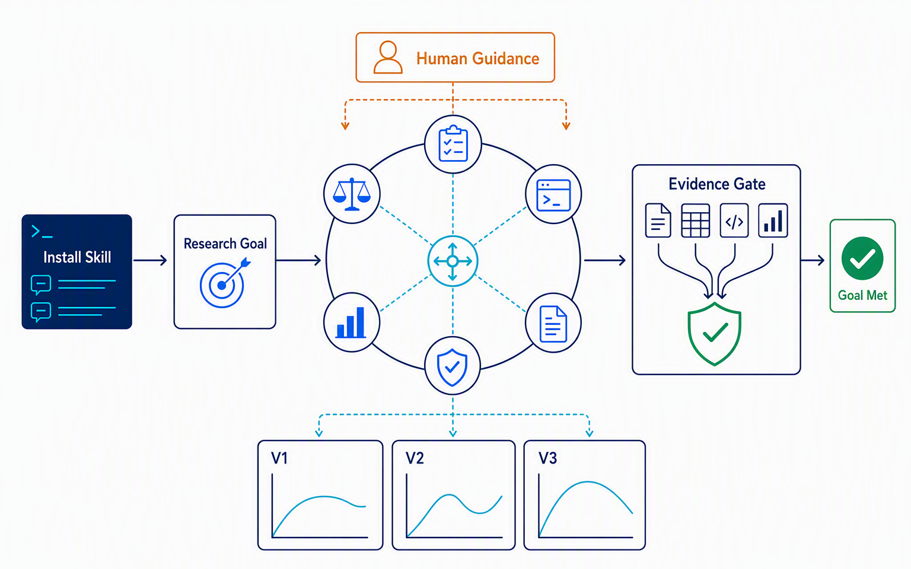

<p align="center">
  
</p>

<p align="center">
  <strong>An evidence-gated, human-steerable research loop for local deep-learning codebases.</strong>
</p>

<p align="center">
  <a href="LICENSE"></a>
  
  
</p>

<p align="center">
  
</p>

Easy-Auto-Research for Deep Learning is a prototype skill that runs an iterative research loop around a local deep-learning codebase. Six role-separated Claude Code sessions propose experiments, create versioned code copies, launch and monitor training, evaluate on-disk evidence against a user-approved goal, and retain state across cycles.

The project does not guarantee scientific quality, reproducibility, or operational safety. Claude Code-generated experiments require human review and can consume substantial API tokens, GPU time, disk space, energy, and wall-clock time.

## Requirements

- Python 3.10 or newer
- Claude Code available on `PATH`
- A Claude Code environment that supports local skills, background processes, and resumable sessions
- Bash on Linux
- A local ML codebase with its datasets, dependencies, training environment, and compute access

Linux is the tested runtime. No minimum Claude Code version is claimed; verify those Claude Code capabilities before installation. The optional literature-search helper requires access to the public arXiv and GitHub APIs.

## Install

Clone the repository with your Git client, or download and extract its archive, then enter the checkout:

```bash
cd Easy-Auto-Research-for-Deep-Learning
```

Install the skill:

```bash
./install.sh
```

Without an argument, the installer creates and uses `~/.claude/skills`. To use another Claude Code skills directory, pass it explicitly:

```bash
./install.sh "/absolute/path/to/claude/skills"
```

The installer creates the destination directory and replaces any existing `easy-auto-research` copy. Fully exit and restart Claude Code after installation. In the new session, ask "List the installed skills and confirm that easy-auto-research is available." If it is missing, reinstall to the intended Claude Code skills directory and restart Claude Code again.

## Quick start

Open Claude Code and name the installed skill in an ordinary request. This README documents the natural-language interface. Provide an absolute path to the local codebase and a concrete research objective:

> Use the easy-auto-research skill on `/home/alice/projects/domainbed`. Improve ColoredMNIST test accuracy without changing the dataset implementation or installing new packages. Ask me for any missing details, prepare a separate run project, and do not start the research loop until I approve the goal.

The skill will:

1. ask for missing `research_spec` details, including the training entry point, metric and direction, baseline or success criterion when known, allowed changes, and prohibited changes;
2. prepare a separate, self-contained run project without modifying the installed skill bundle;
3. inspect the codebase and generate `goal.md`, `PROJECT_BRIEF.md`, and six role prompts;
4. ask you to review `goal.md` and correct any objective, metric, path, or constraint;
5. explain that the loop consumes Claude Code tokens and may launch long-running, GPU-intensive training; and
6. wait for explicit confirmation before starting the loop.

A successful setup response should look like this:

> Prepared the run project at `/runs/dg-study/project`. Generated `research_spec.json`, `goal.md`, `PROJECT_BRIEF.md`, and six role prompts under `agents/`. Please review the objective, metric, paths, and constraints in `goal.md`. This loop will consume Claude Code tokens and may launch GPU training. Shall I start it?

Later control requests should name that same run-project path, for example: "Resume the easy-auto-research run at `/runs/dg-study/project`; summarize why it stopped and ask before training."

## Invocation examples

Requests do not need to specify runtime scripts, project-state files, internal channels, or command-line options.

### Optimize an existing training setup

> Use easy-auto-research with `/srv/ml/image-classifier`. Maximize validation macro F1 using the existing environment and one GPU. Keep the data split fixed and do not modify files outside the experiment copies. Ask me for any missing research details before preparing the goal.

### Investigate training instability

> Start an easy-auto-research project for `/work/models/segmentation`. Find a configuration or code change that prevents loss from becoming NaN while preserving mean IoU. The training procedure is documented in that repository. Do not replace the optimizer family or download new data. Show me `goal.md` before any training.

### Compare structural methods

> Apply easy-auto-research to `/mnt/research/domain-generalization`. Improve worst-domain accuracy over the recorded baseline by testing literature-grounded structural changes, not only hyperparameters. Preserve the current dataset, environment, and baseline artifacts. Ask me for the success threshold and run-project location.

### Reduce memory use

> Set up easy-auto-research for `/home/bob/lm-finetuning`. Minimize peak VRAM while keeping evaluation loss within 1 percent of the baseline. Training must stay on one GPU, the base checkpoint is read-only, and package installation is prohibited. Prepare the research goal and wait for my approval.

## Run controls

After setup, include the run-project path in each control request so the skill can locate its stored state.

- Steer the next cycle: "For the easy-auto-research run at `/runs/dg-study/project`, keep the current experiment running, but have the next plan test a smaller penalty and stop changing the data pipeline."
- Interrupt the active Claude Code role: "Interrupt the active Claude Code role in `/runs/dg-study/project`. The current work uses the wrong split. Have that role inspect the configuration before continuing."
- Resume: "Resume `/runs/dg-study/project`. First explain why it stopped and what will run next, then ask for confirmation before consuming more tokens or GPU time."
- Reset: "Reset `/runs/dg-study/project` to its post-initialization state. Preview every path that would be removed or emptied and wait for explicit confirmation."

Strategic guidance takes effect at the next planning boundary unless the user requests an interrupt. An interrupt stops only the active Claude Code role subprocess, delivers the instruction to that role, and then resumes it; it does not stop the harness or guarantee that an already launched training job stops. The installed skill has no separate inspect or natural-language stop task. Stop the foreground Claude Code operation with Claude Code's normal interrupt control, then use the resume request above when ready. Durable history remains on disk.

## How the loop works

The teaser above summarizes the path from skill installation and goal review through versioned experiments and evidence-gated completion. The Orchestrator routes role turns without retaining state. The Planner selects one experiment. The Executer changes a versioned copy within the approved constraints and launches training. The Secretary writes a cycle report, the Verifier monitors completion or failure, and the Evaluator checks the goal against local evidence. Only the Evaluator may declare the goal met, and the harness accepts that verdict only when the cited evidence exists in the current version.

The loop can stop when the Evaluator validates success, the foreground operation is interrupted, a configured cycle or stall limit is reached, or an unrecoverable failure occurs. The harness checks required files and formats and verifies that evidence comes from the current version. These checks do not establish scientific validity.

## Run behavior

During setup, the skill validates the research specification without fabricating metric names, thresholds, commands, or paths. It inspects the target codebase statically by default because imports may have side effects, then generates the goal, project brief, and six role prompts.

Each task uses a separate run project with a copied runtime; the installed skill directory remains unchanged. Experiments live under `WorkSpace/` as `V1_baseline` and `V<number>_<description>` copies. Version creation rejects unsafe names, path traversal, symlink escapes, missing sources, and existing targets. Sessions, interactions, reports, plans, metrics, and accumulated findings remain on disk for inspection and resumption.

The skill applies user guidance through ordered, append-only channels with acknowledgements and retries. Before signaling a training process, it checks structured process identity. Stall, duplicate-plan, and no-improvement guards redirect or stop repeated loops, and `GOAL_MET` is accepted only when the Evaluator cites evidence from the current version.

## Safety and permissions

Permission bypass is off by default. Setup and every loop role run through Claude Code under its normal permission policy. If Claude Code requires approval for file edits, commands, or process launch, the loop pauses or fails while waiting for that decision; normal operation therefore requires supervision. The skill selects restricted operation unless the user explicitly requests permission bypass; that mode passes Claude Code's permission-bypass option and should only be used in a trusted, isolated environment.

Before starting or resuming the research loop, review:

- the objective, primary metric, baseline, and success criterion in `goal.md`;
- the exact training entry point and environment;
- files and directories that may or may not be changed;
- dataset, checkpoint, network, package-installation, and Git restrictions; and
- GPU count, expected run length, storage budget, and token budget.

Setup does not authorize training. Starting or resuming the research loop requires a separate explicit confirmation because it consumes Claude Code tokens and may consume GPU resources. Reset operations require a path preview and explicit confirmation. Do not reset a live run.

The default cycle limit is unlimited and the default stall limit is five consecutive idle cycles. The skill asks the user to define GPU count, expected run length, storage budget, and token budget before launch, but the framework does not enforce token, GPU-time, disk, or monetary budgets. Cycle and stall limits are runtime configuration in the copied run project; users set desired limits in the natural-language request and the skill applies them internally.

When the foreground operation receives an interrupt, the harness terminates its active Claude Code role process group. A recorded training process is signaled only when its structured receipt still matches the recorded UID, process start time, working directory, and command. Legacy integer-only PID records are not killed automatically.

## Project and output layout

Each research task receives a dedicated run project and sibling output directories:

```text
<run-root>/
├── <run-project>/
│   ├── research_spec.json
│   ├── goal.md
│   ├── PROJECT_BRIEF.md
│   ├── agents/                 # role prompts and persistent sessions
│   ├── agent_interactions/     # per-call audit records
│   └── durable ledgers, logs, and control state
├── WorkSpace/
│   ├── V1_baseline/
│   ├── V2_<experiment>/
│   └── V3_<experiment>/
└── CycleReport/                # Secretary reports
```

Experiment directories contain code copies and training artifacts. The run project contains the approved goal and durable coordination state. Concurrent research tasks should use distinct run roots so their sibling `WorkSpace/` and `CycleReport/` directories do not collide.

## Bundled helper skills

The research roles can use these helpers internally:

| Skill | Purpose |
| --- | --- |
| [`analyze-hpo`](easy-auto-research/scripts/Skills/analyze-hpo/SKILL.md) | Read-only metric and hyperparameter correlation summaries across version directories. |
| [`arxiv-verified-search`](easy-auto-research/scripts/Skills/arxiv-verified-search/SKILL.md) | Read-only arXiv search limited to papers that advertise an existing GitHub repository above a configurable star threshold. |
| [`disciplined-edit`](easy-auto-research/scripts/Skills/disciplined-edit/SKILL.md) | Out-of-tree snapshots, minimal diff review, and intra-turn revert support for code edits. |
| [`estimate-vram`](easy-auto-research/scripts/Skills/estimate-vram/SKILL.md) | CPU-only planning estimates for model state and activation memory. |
| [`humanizer`](easy-auto-research/scripts/Skills/humanizer/SKILL.md) | Guidance for clear, natural technical reports. |
| [`inspect-batch`](easy-auto-research/scripts/Skills/inspect-batch/SKILL.md) | Read-only inspection of one project-provided batch for shapes, ranges, and label distribution. |
| [`inspect-checkpoint`](easy-auto-research/scripts/Skills/inspect-checkpoint/SKILL.md) | Read-only per-tensor checkpoint statistics and numerical diagnostics. |
| [`reset-project`](easy-auto-research/scripts/Skills/reset-project/SKILL.md) | Preview-first cleanup of generated run state with explicit confirmation before deletion. |
| [`validate-before-run`](easy-auto-research/scripts/Skills/validate-before-run/SKILL.md) | Syntax, lint, and optional import checks before a long job is launched. |

Helper output is diagnostic, not proof of causality or correctness. Some helpers require target-project dependencies such as PyTorch. Literature search depends on external services and their rate limits.

## Limitations

- This research prototype requires expert supervision. Claude Code role proposals, code changes, early-stopping decisions, metrics, and conclusions can be wrong.
- Evaluator evidence checks do not establish statistical soundness, reproducibility, novelty, or generalizability.
- Results depend on the target repository, training environment, Claude model availability and behavior, hardware, and external services.
- The framework cannot make unsafe training code, datasets, credentials, or infrastructure safe. Use appropriate isolation, least privilege, backups, and resource limits.

## Development and tests

Contributors can run the release test suite from the repository root:

```bash
PYTHONDONTWRITEBYTECODE=1 python -m unittest discover -s tests -v
```

CI runs the suite on Python 3.10, 3.11, and 3.12. It also checks Python compilation, installer syntax, JSON templates, runtime help entry points, and the absence of generated bytecode caches.

## Third-party notice

The bundled Humanizer prompt skill is copyright Siqi Chen and is distributed under its bundled MIT license. See [NOTICE](NOTICE) and [the bundled Humanizer license](easy-auto-research/scripts/Skills/humanizer/LICENSE).

## License

Easy-Auto-Research for Deep Learning is released under the [MIT License](LICENSE).
